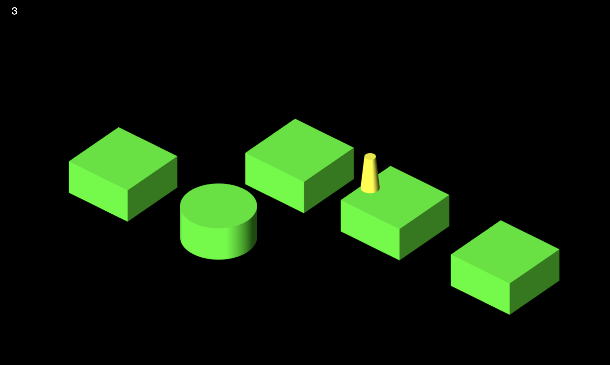
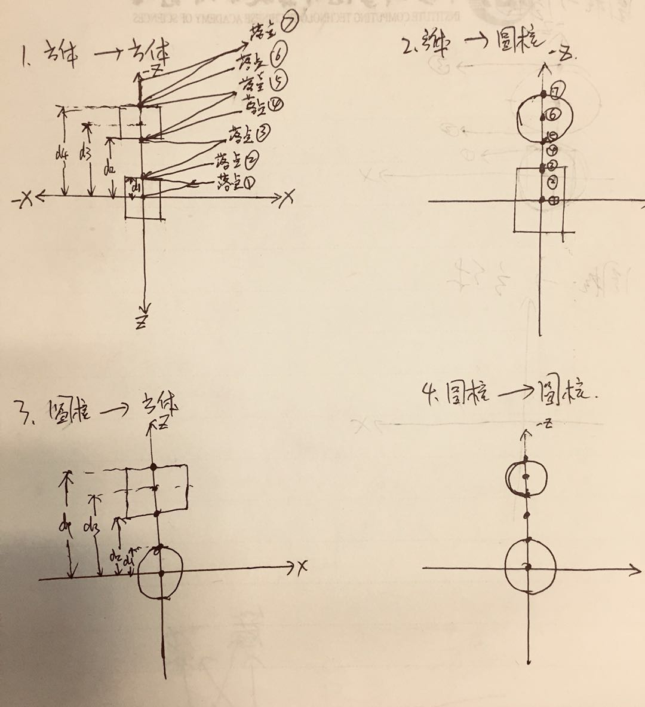

# threejs-jump

用 threejs 模仿微信跳一跳程序

## 效果

[查看Demo](https://linghuam.github.io/threejs-jump/index.html)



## 原理

跳一跳分为两类物体，一类是跳动的小跳棋对象，一类是跳棋降落的物体。

这里的物体形状主要是立方体和圆柱体，规则的几何体利于计算跳棋的落点，
通过随机数可以生成这两类物体。

物体之间的位置关系可以分为两类，在xz平面上，下一个物体可能在上一个物体的
-z轴正方向，也可能在 +x 轴方向。

跳棋不同的落点对应不同的动画和处理方式，所以判断落点要分类讨论，落点可能的情况
如下图所示：

通过比较落点跟几个特殊点之间的距离来判断降落类型。

```js
// 随机产生一个图形
createCube: function (){
  var relativePos = Math.random() > 0.5 ? 'zDir' : 'xDir';
  // var relativePos = 'xDir';
  var cubeType = Math.random() > 0.5 ? 'cube' : 'cylinder';

  var geometry = cubeType === 'cube' ?
  new THREE.CubeGeometry(this.config.cubeX, this.config.cubeY, this.config.cubeZ):
  new THREE.CylinderGeometry(this.config.cylinderRadius, this.config.cylinderRadius, this.config.cylinderHeight, 100);
  var color = cubeType === 'cube' ? this.config.cubeColor : this.config.cylinderColor;
  var material = new THREE.MeshLambertMaterial( { color: color } );
  var mesh = new THREE.Mesh(geometry, material);

  // 产生随机图形
  if (this.cubes.length){
    var dis = this.getRandomValue(this.config.cubeMinDis, this.config.cubeMaxDis);
    var lastcube = this.cubes[this.cubes.length - 1];
    if (relativePos === 'zDir'){
      if (cubeType === 'cube'){
        if (lastcube.geometry instanceof THREE.CubeGeometry)
          // 方体 -> 方体
          mesh.position.set(lastcube.position.x, lastcube.position.y, lastcube.position.z - dis - this.config.cubeZ );
        else  // 方体 -> 圆柱体
          mesh.position.set(lastcube.position.x, lastcube.position.y, lastcube.position.z - dis - this.config.cylinderRadius - this.config.cubeZ / 2);
      } else {
        if (lastcube.geometry instanceof THREE.CubeGeometry)
           // 圆柱体 -> 方体
           mesh.position.set(lastcube.position.x, lastcube.position.y, lastcube.position.z - dis - this.config.cylinderRadius - this.config.cubeZ / 2);
        else
          // 圆柱体 -> 圆柱体
           mesh.position.set(lastcube.position.x, lastcube.position.y, lastcube.position.z -  dis - this.config.cylinderRadius * 2 );
      }
    } else {
      if (cubeType === 'cube'){
        if (lastcube.geometry instanceof THREE.CubeGeometry)
          // 方体 -> 方体
          mesh.position.set(lastcube.position.x + dis + this.config.cubeX, lastcube.position.y, lastcube.position.z);
        else  // 方体 -> 圆柱体
          mesh.position.set(lastcube.position.x + dis + this.config.cubeX / 2 + this.config.cylinderRadius, lastcube.position.y, lastcube.position.z);
      } else {
        if (lastcube.geometry instanceof THREE.CubeGeometry)
           // 圆柱体 -> 方体
           mesh.position.set(lastcube.position.x + dis + this.config.cylinderRadius + this.config.cubeX / 2 , lastcube.position.y, lastcube.position.z);
        else
          // 圆柱体 -> 圆柱体
           mesh.position.set(lastcube.position.x + dis + this.config.cylinderRadius * 2, lastcube.position.y, lastcube.position.z);
      }
    }
  } else {
    mesh.position.set(0, 0, 0);
  }

  this.testPosition(mesh.position);
  this.cubes.push(mesh);
  this.scene.add(mesh);
  this._render();
  // 如果缓存图形数大于最大缓存数，去掉一个
  if (this.cubes.length > this.config.cubeMaxLen){
    this.scene.remove(this.cubes.shift());
  }
  if (this.cubes.length > 1){
    // 更新相机位置
    this._updateCameraPos();
  } else {
    this.camera.lookAt(this.cameraPos.current);
  }
}
```

```js
/*
* 根据落点判断是否成功或失败，共分为以下几种情况
* 返回值 1： 成功，但落点仍然在当前块上
* 返回值 2： 成功，落点在下一个块上
* 返回值 3： 成功，落点在中心点 （先不考虑，后续优化）
* 返回值 -1：失败，落点在当前块边缘 或 在下一个块外边缘
* 返回值 -2：失败，落点在当前块与下一块之间 或 在下一个块之外
* 返回值 -3：失败，落点在下一个块内边缘
 */
getJumpState: function (){
    var jumpR = this.config.jumpBottomRadius;
    var vard = this.getd();
    var d = vard.d;
    var d1 = vard.d1;
    var d2 = vard.d2;
    var d3 = vard.d3;
    var d4 = vard.d4;
    if (d <= d1) {
      return 1;
    }  else if (d > d1 && Math.abs(d - d1) <= jumpR) {
      return -1;
    } else if (Math.abs(d - d1) > jumpR && d < d2 && Math.abs(d - d2) >= jumpR){
      return -2;
    } else if ( d < d2 && Math.abs(d - d2) < jumpR){
      return -3;
    } else if ( d > d2 && d <= d4){
      return 2;
    } else if ( d > d4 && Math.abs(d - d4) < jumpR){
      return -1;
    } else {
      return -2;
    }
},

getd: function (){
  var d, d1, d2, d3, d4;
  var fromObj = this.cubes[this.cubes.length - 2];
  var fromPosition = fromObj.position;
  var fromType = fromObj.geometry instanceof THREE.CubeGeometry ? 'cube' : 'cylinder';
  var toObj = this.cubes[this.cubes.length - 1];
  var toPosition = toObj.position;
  var toType = toObj.geometry instanceof THREE.CubeGeometry ? 'cube' : 'cylinder';
  var jumpObj = this.jumper;
  var position = jumpObj.position;

  if (fromType === 'cube'){
     if (toType === 'cube'){
         if ( fromPosition.x === toPosition.x ){
           // -z 方向
           d = Math.abs(position.z);
           d1 = Math.abs(fromPosition.z - this.config.cubeZ / 2);
           d2 = Math.abs(toPosition.z + this.config.cubeZ / 2);
           d3 = Math.abs(toPosition.z);
           d4 = Math.abs(toPosition.z - this.config.cubeZ / 2);
         } else {
           // x 方向
           d = Math.abs(position.x);
           d1 = Math.abs(fromPosition.x + this.config.cubeX / 2);
           d2 = Math.abs(toPosition.x - this.config.cubeX / 2);
           d3 = Math.abs(toPosition.x);
           d4 = Math.abs(toPosition.x + this.config.cubeX / 2);
         }
     } else {
       if ( fromPosition.x === toPosition.x ){
         // -z 方向
         d = Math.abs(position.z);
         d1 = Math.abs(fromPosition.z - this.config.cubeZ / 2);
         d2 = Math.abs(toPosition.z + this.config.cylinderRadius);
         d3 = Math.abs(toPosition.z);
         d4 = Math.abs(toPosition.z - this.config.cylinderRadius);
       } else {
         // x 方向
         d = Math.abs(position.x);
         d1 = Math.abs(fromPosition.x + this.config.cubeX / 2);
         d2 = Math.abs(toPosition.x - this.config.cylinderRadius);
         d3 = Math.abs(toPosition.x);
         d4 = Math.abs(toPosition.x + this.config.cylinderRadius);
       }
     }
  } else {
    if (toType === 'cube'){
      if ( fromPosition.x === toPosition.x ){
        // -z 方向
        d = Math.abs(position.z);
        d1 = Math.abs(fromPosition.z - this.config.cylinderRadius);
        d2 = Math.abs(toPosition.z + this.config.cubeZ / 2);
        d3 = Math.abs(toPosition.z);
        d4 = Math.abs(toPosition.z - this.config.cubeZ / 2);
      } else {
        // x 方向
        d = Math.abs(position.x);
        d1 = Math.abs(fromPosition.x + this.config.cylinderRadius);
        d2 = Math.abs(toPosition.x - this.config.cubeX / 2);
        d3 = Math.abs(toPosition.x);
        d4 = Math.abs(toPosition.x + this.config.cubeX / 2);
      }
    } else {
      if ( fromPosition.x === toPosition.x ){
        // -z 方向
        d = Math.abs(position.z);
        d1 = Math.abs(fromPosition.z - this.config.cylinderRadius);
        d2 = Math.abs(toPosition.z + this.config.cylinderRadius);
        d3 = Math.abs(toPosition.z);
        d4 = Math.abs(toPosition.z - this.config.cylinderRadius);
      } else {
        // x 方向
        d = Math.abs(position.x);
        d1 = Math.abs(fromPosition.x + this.config.cylinderRadius);
        d2 = Math.abs(toPosition.x - this.config.cylinderRadius);
        d3 = Math.abs(toPosition.x);
        d4 = Math.abs(toPosition.x + this.config.cylinderRadius);
      }
    }
  }

  return {d: d, d1: d1, d2: d2, d3: d3, d4: d4};
}
```
